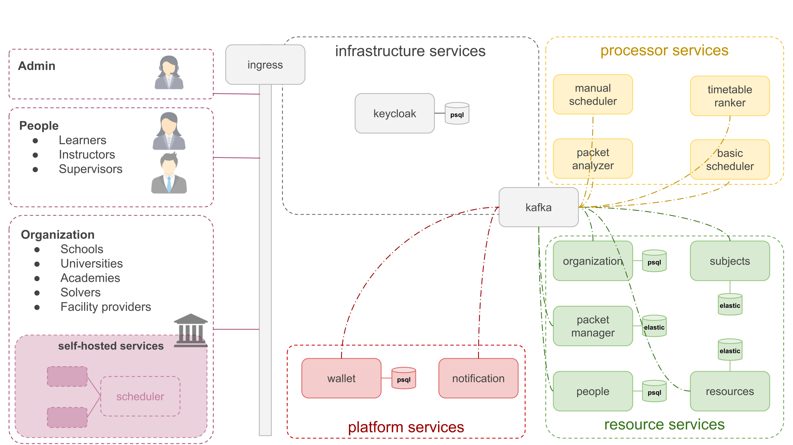

# **Architecture**

The Distributed Timetable Assistant (DTA) is a Kubernetes-first microservices platform with clear separation of concerns: **Resource Services**, **Processor Services**, **Cloud-exclusive Platform Services**, and **Infrastructure Services**. Resource and Processor services can be run as cloud-shared services (tiered plans) **or** deployed self-hosted inside customer environments; cloud-exclusive services are only available from the hosted platform. The architecture uses Kafka as the central event bus, Postgres/Elasticsearch/Redis for state, and Keycloak for identity.

---

## Service summary table

| Group                        |          Service | Persistence / stores               | Self-hostable |
|------------------------------|-----------------:| ---------------------------------- |:-------------:|
| **Resource services**        |   packet-manager | Elasticsearch (primary index)      |       ✅       |
|                              |           people | PostgreSQL                         |       ✅       |
|                              |     organization | PostgreSQL                         |       ✅       |
|                              |        resources | PostgreSQL                         |       ✅       |
|                              |         subjects | PostgreSQL                         |       ✅       |
| **Processor services**       |  basic-scheduler | PostgreSQL + Redis                 |       ✅       |
|                              | manual-scheduler | PostgreSQL + Redis                 |       ✅       |
|                              |  packet-analyzer | PostgreSQL                         |       ✅       |
|                              | timetable-ranker | (ephemeral & DB as needed)         |       ✅       |
| **Cloud-exclusive platform** |           wallet | (analytics store; may use ES/PSQL) |       ❌       |
|                              |     notification | PostgreSQL                         |       ❌       |
| **Infrastructure**           |          ingress | —                                  |       —       |
|                              |            kafka | — (stateful)                       |       —       |
|                              |         keycloak | PostgreSQL (Keycloak DB)           |       —       |

---

## Service details

### Resource services (self-hostable / cloud-shared)

These services contain canonical domain data and publish domain events to Kafka. They are the primary candidates for customer self-hosting when data locality is required.

#### `packet-manager`

* **Role:** Manages timetable packets (submissions, search index, versions), stores indexed representations and search metadata.
* **Persistence:** **Elasticsearch** (primary index); may also keep metadata in PostgreSQL if needed.
* **API:** REST/gRPC endpoints for create/read/update/search; produces events (e.g., `packet.created`, `packet.updated`) to Kafka.
* **Deployment hints:** Stateful/managed ES or operator (ECK / Opensearch operator) for reliability; replicas and index lifecycle policies required.

#### `people`

* **Role:** Stores learner, instructor, supervisor profiles, credentials metadata, availability calendars (links to time-blocks).
* **Persistence:** **PostgreSQL**.
* **API / Events:** CRUD endpoints; emits `person.created` / `person.updated` / `person.availability.changed` events to Kafka.
* **Self-host notes:** Allow sync/backups for institutions that want to keep identity locally.

#### `organization`

* **Role:** Stores organization metadata (schools, universities, academies, facility providers, solver registrations).
* **Persistence:** **PostgreSQL**.
* **Events:** `organization.*` domain events for changes in facility availability, policies, or membership.

#### `resources`

* **Role:** Catalog of educational materials and facility metadata (rooms, equipment), attachments or pointers to object storage.
* **Persistence:** **PostgreSQL** (metadata) and object store (S3) for large assets; may index in Elasticsearch for content search.
* **Events:** `resource.*` events for material updates affecting scheduling.

#### `subjects`

* **Role:** Canonical subject definitions (e.g., “Physics 2”), mapping of subjects to curricula and competency metadata.
* **Persistence:** **PostgreSQL**.
* **Events:** `subject.*` events used by schedulers and packet analyzers.

---

### Processor services (self-hostable / cloud-shared)

Processors consume domain events, run scheduling logic, and publish candidates/results.

#### `basic-scheduler`

* **Role:** Automated timetable generator (batch/stream mode) that creates candidate timetables based on constraints and resource availability.
* **Persistence:** **PostgreSQL** (durable job / result store) + **Redis** (caches, distributed locks, ephemeral job state, worker queues).
* **Integration:** Subscribes to Kafka topics (resource updates, new packets); writes candidates back to `packet-manager` (or to a results topic).
* **Scaling:** Horizontal workers; Redis-backed queues for task distribution.

#### `manual-scheduler`

* **Role:** Human-in-the-loop scheduling assistant supporting GUI-based edits, conflict resolution, and confirmations.
* **Persistence:** **PostgreSQL** + **Redis** for ephemeral session state.
* **Behavior:** Accepts operator edits, publishes modifications to Kafka so ranker/notification can react.

#### `timetable-ranker`

* **Role:** Scores and ranks candidate timetables from multiple schedulers (features from packet-analyzer + telemetry).
* **Persistence / storage:** May use an analytics DB or cache; primary operation is stream processing of candidate events.
* **Integration:** Consumes candidates from Kafka, emits `candidate.ranked` events.

#### `packet-analyzer`

* **Role:** Feature extraction and analytics for submitted packets (complexity, conflict density, resource usage).
* **Persistence:** Analytical store (Elasticsearch or analytic Postgres), intermediate caches.
* **Use:** Feeds features to the ranker and to metric dashboards.

---

### Cloud-exclusive platform services (hosted only)

Services that the platform provides but are not part of the baseline self-host offering.

#### `wallet`

* **Role:** Marketplace ledger/credits management for solvers, microservices and institutions.
* **Persistence:** **PostgreSQL** (transactional ledger).
* **Security:** Strong auditing; integrate with external payment providers for top-ups.

#### `notification`

* **Role:** Centralized subscription and delivery engine (email, push, SMS integrations).
* **Persistence:** **PostgreSQL** for subscription config and templates.
* **Integration:** Consumes events (e.g., `candidate.finalized`, `wallet.balance.low`) and triggers deliveries.

---

### Infrastructure services (cluster-level)

Cross-cutting components required by all services.

#### `ingress`

* **Role:** Tenant-aware edge routing, TLS termination, path-based or host-based routing for self-hosted vs cloud endpoints.
* **Examples:** NGINX Ingress, Traefik, or a cloud load balancer.

#### `kafka`

* **Role:** Central event bus used for decoupling producers (resource & platform services) and consumers (processors, analytics).
* **Operational:** Multi-zone replication, topic retention/policy, schema registry recommended for event contracts (Avro/Protobuf).

#### `keycloak`

* **Role:** Identity and access management (OAuth2/OpenID Connect). Centralized realm and client configuration.
* **Persistence:** **PostgreSQL** backing store for Keycloak data.
* **Notes:** For self-hosted installs, allow integration with the institution’s IAM or run a local Keycloak instance.

---

## How the pieces interact (short flow)

1. Clients → **Ingress** → authenticated via **Keycloak**.
2. CRUD on domain entities → Resource services (Postgres / ES) → emit domain events to **Kafka**.
3. Processor services consume Kafka, produce candidate timetables → write results back to `packet-manager` and emit ranked/candidate events.
4. `packet-analyzer` and `timetable-ranker` consume streams to score and finalize selections.
5. Platform services (`wallet`, `notification`) handle transactions and user communication for marketplace actions.