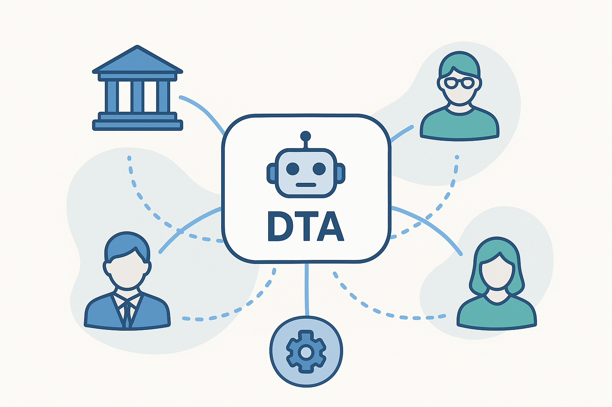

# **Introduction**

Educational scheduling is inherently complex, involving multiple institutions, instructors, supervisors, learners, and limited resources such as classrooms, labs, and physical locations. Traditional centralized scheduling systems often struggle to balance these constraints efficiently, leading to suboptimal timetables, conflicts, and a heavy administrative burden. They rarely accommodate individual preferences, geographic considerations, or adapt quickly to changing circumstances.

The Distributed Timetable Assistant (DTA) was created to address these challenges. By decentralizing the scheduling process, DTA enables a collaborative ecosystem where human and automated participants can propose, validate, and iteratively refine timetable solutions. Each organization defines its own participants, courses, constraints, and resource availability, while independent scheduler services work to optimize schedules across the network. The platform also considers practical constraints, such as locations, distances, and resource utilization, ensuring that generated timetables are feasible, realistic, and efficient for both institutions and participants.

Designed for schools, universities, and online training platforms, DTA offers a scalable, fault-tolerant, and flexible approach to educational planning. Its distributed architecture fosters community-driven collaboration, encourages iterative improvement, and ensures high-quality timetables that better meet the operational needs of institutions, the personal preferences of instructors and learners, and the logistical realities of educational environments.

