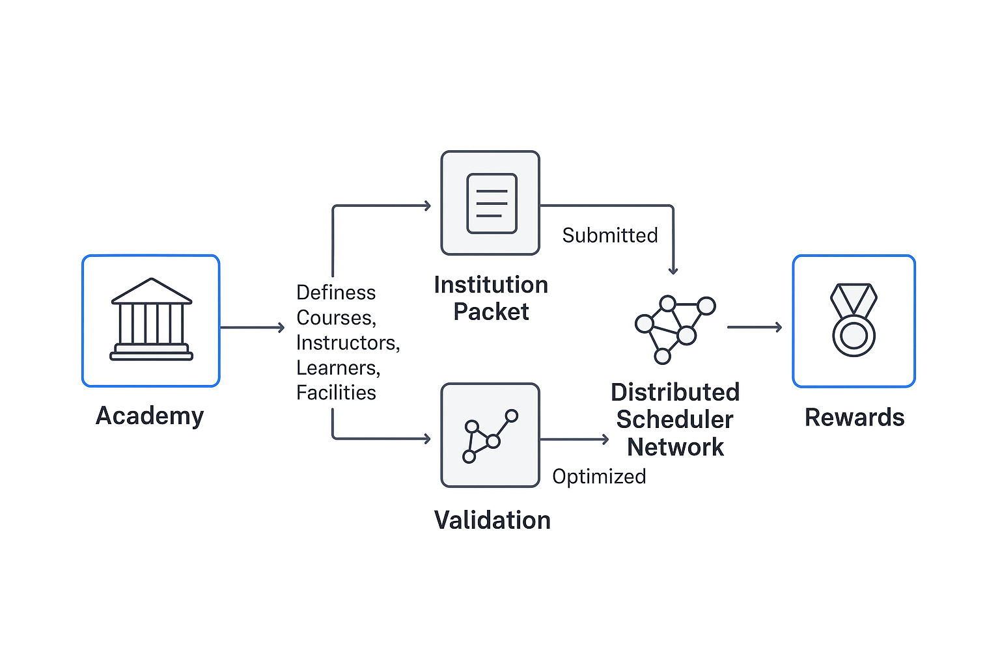

# Overview

The Distributed Timetable Assistant (DTA) is a decentralized platform designed to automate and optimize educational scheduling across multiple institutions, instructors, and learners.
Unlike traditional centralized scheduling systems, DTA distributes the process of generating and evaluating timetable solutions among multiple independent microservices — allowing scalability, fault tolerance, and open participation.

Each educational organization (called an Academy) defines its own set of courses, instructors, learners, and facilities. These details are packaged into structured data units known as Institution Packets.
DTA then exposes these packets to a distributed network of scheduler services, where each participant (human or automated) can propose optimized scheduling solutions.
Accepted solutions are validated and rewarded via an internal token-based mechanism, creating an open marketplace for scheduling computation.

The platform is built with modularity and interoperability in mind.
Its backend consists of Rust-based microservices orchestrated via Kubernetes, while the frontend provides web interfaces for administrators, instructors, and organizations to manage their data and visualize results.
Through this distributed architecture, DTA enables flexible, large-scale, and community-driven educational scheduling — suitable for schools, universities, and online training platforms

|                                                                                                                                                                            | 
|:-------------------------------------------------------------------------------------------------------------------------------------------------------------------------------------------------------------------------:| 
| *The figure illustrates how academies define their data as Institution Packets, which are processed by the distributed scheduler network. Validated solutions are rewarded through DTA’s decentralized incentive system.* |