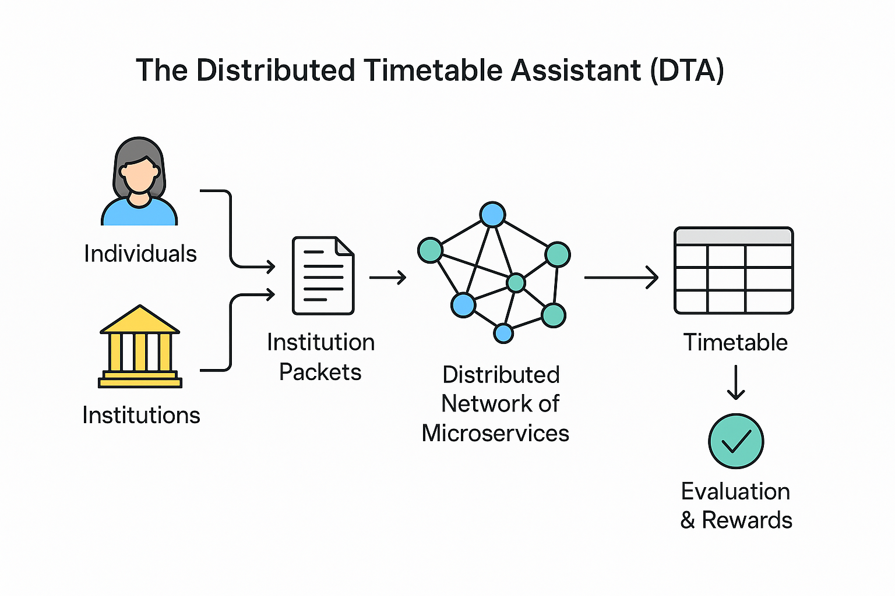

# **Overview**

The **Distributed Timetable Assistant (DTA)** is a **decentralized scheduling platform** that automates and optimizes the creation of educational timetables across institutions, instructors, supervisors, and learners.  
Unlike traditional centralized scheduling systems, DTA distributes both computation and decision-making across a network of independent microservices, enabling scalability, flexibility, and community participation.

  
*Figure: DTA core concepts — Institution Packets, independent solver services, privacy, real-world awareness, and architectural strengths.*

---

## Concept Summary

Each organization defines its own set of courses, instructors, learners, supervisors, and available facilities, together with academic rules and preferences.  
These definitions are packaged into structured data units called **Institution Packets**, which are then shared within the DTA ecosystem. Independent solver services — either human-managed or automated — can access these packets, propose optimized scheduling solutions, and receive rewards for accepted results. The diagram above visualizes how institutions, the DTA core, and independent solvers interact.

---

## Core Principles

### 1. Decentralization
DTA eliminates reliance on a central scheduling engine by distributing scheduling logic across independent solver microservices. Each solver contributes computational power and optimization algorithms to the shared ecosystem.

### 2. Collaboration and Reward
Participants can compete or collaborate in proposing solutions. Accepted timetables are rewarded through a built-in incentive mechanism that promotes fairness, innovation, and continuous improvement.

### 3. Privacy and Control
Institutions retain full control over their internal data and can configure their visibility level in the network. This privacy-first approach allows sensitive environments to benefit from distributed scheduling without exposing confidential information.

### 4. Real-world Awareness
DTA models practical, operational constraints to ensure produced timetables are feasible and actionable. These include:
- Classroom and lab availability.  
- Instructor and learner availability and preferences.  
- Physical locations and travel distances between facilities.  
- Time overlaps, capacity limits, and other scheduling feasibility checks.

---

## Architectural Strengths

DTA’s distributed architecture is designed to deliver:

- **Scalability:** Workloads and optimization tasks can be shared across multiple solver nodes to handle large, heterogeneous scheduling problems.  
- **Fault Tolerance:** Independent microservices and solver nodes reduce single points of failure and increase overall system resilience.  
- **Autonomy:** Each institution can operate independently (self-hosting, private deployments) while participating in the shared marketplace.  
- **Continuous Improvement:** Iterative refinement and solver competition/collaboration improve schedule quality over time.

---

## Summary

By combining **decentralized computation**, **privacy-first design**, and an **open solver marketplace**, DTA establishes a collaborative, realistic, and self-improving ecosystem for educational scheduling. It is designed to serve schools, universities, and online learning environments worldwide—helping institutions produce timetables that are not only optimized mathematically but practical in the real world.

---
