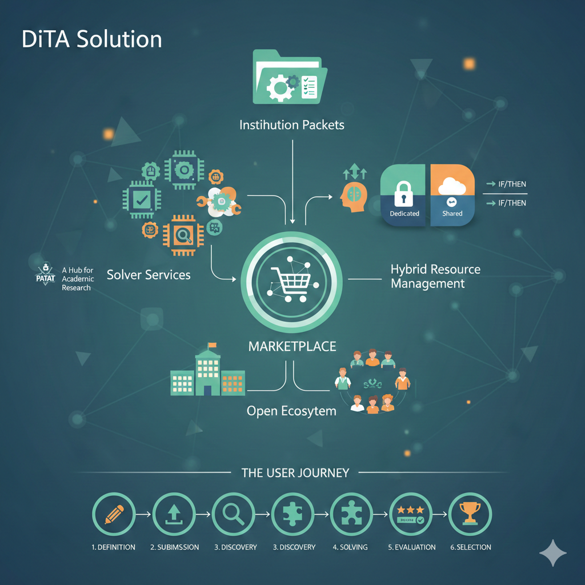

# **نمای کلی**

## چالش
زمان‌بندی آموزشی ذاتاً پیچیده است. این امر شامل ایجاد تعادل بین نیازهای ذینفعان متعدد - موسسات، مدرسان، ناظران و یادگیرندگان - در برابر منابع محدودی مانند کلاس‌های درس و آزمایشگاه‌ها است. سیستم‌های متمرکز سنتی اغلب با این پیچیدگی دست و پنجه نرم می‌کنند که منجر به برنامه‌های خشک می‌شود که در برآوردن ترجیحات فردی یا سازگاری با تغییرات ناتوان هستند.

## راهکار DiTA
**دستیار جدول زمانی توزیع‌شده (DiTA)** این چالش‌ها را از طریق عدم تمرکز حل می‌کند. این پلتفرم بازاری ایجاد می‌کند که در آن مسائل زمان‌بندی با حل‌کنندگان مستقل مطابقت داده می‌شوند.

### مفاهیم کلیدی

*   **بسته‌های موسسه (Institution Packets):** واحدهای داده ساختاریافته که در آن سازمان‌ها شرکت‌کنندگان، دروس، محدودیت‌ها و منابع خود را تعریف می‌کنند.
*   **سرویس‌های حل‌کننده (Solver Services):** میکروسرویس‌های مستقل (انسانی یا خودکار) که راه‌حل‌های جدول زمانی را پیشنهاد می‌دهند.
*   **بازار (Marketplace):** اکوسیستمی که در آن بسته‌ها منتشر می‌شوند و راه‌حل‌ها مبادله می‌شوند.

### ویژگی‌های منحصر به فرد

#### ۱. اکوسیستم باز
پلتفرم DiTA فقط برای مدارس نیست. این پلتفرمی است که **هر کسی** می‌تواند در آن ثبت نام کند و منابع را مدیریت کند.
*   **شرکت‌کنندگان:** معلمان، دانش‌آموزان، ناظران.
*   **امکانات:** مدارس، دانشگاه‌ها، باشگاه‌ها، آزمایشگاه‌ها و موارد دیگر.
*   **اشتراک‌گذاری:** کاربران می‌توانند دسترس‌پذیری یا منابع خود را (مثلاً آزمایشگاهی که اسلات‌های خالی خود را اجاره می‌دهد) با کل شبکه به اشتراک بگذارند.

#### ۲. مدیریت منابع ترکیبی
موسسات می‌توانند منابع را به روشی منعطف و ترکیبی تعریف کنند:
*   **اختصاصی:** استفاده از لیست خصوصی معلمان و اتاق‌های خودتان.
*   **مشترک:** درخواست منابع از استخر عمومی.
*   **شرطی:** تعریف قوانینی مانند *"اگر معلمان ریاضی داخلی ما کاملاً رزرو شده‌اند، یک معلم ریاضی تایید شده از پلتفرم درخواست کن."*
این امر برای همه انواع منابع - مدرسان، کلاس‌های درس یا حتی تجهیزات خاص - صدق می‌کند.

#### ۳. مرکزی برای تحقیقات آکادمیک
زمان‌بندی آموزشی یک حوزه تحقیقاتی پویا است، با کنفرانس‌های اختصاصی مانند **PATAT** (Practice and Theory of Automated Timetabling) و مسابقات بین‌المللی (ITC).
پلتفرم DiTA یک بستر آزمایشی دنیای واقعی کامل برای محققان فراهم می‌کند:
*   **داده‌های واقعی:** محققان می‌توانند الگوریتم‌های خود را روی محدودیت‌ها و داده‌های دنیای واقعی (در صورت نیاز ناشناس‌سازی شده) آزمایش کنند.
*   **بنچمارک:** بازار به عنوان یک بنچمارک زنده عمل می‌کند که در آن الگوریتم‌های جدید می‌توانند با الگوریتم‌های موجود رقابت کنند.
*   **پیاده‌سازی:** دانشجویان و دانشگاهیان می‌توانند حل‌کنندگان خود را به عنوان میکروسرویس منتشر کنند و کار خود را از مقالات نظری به کاربرد عملی منتقل کنند.

## چگونه کار می‌کند (سفر کاربر)

۱.  **تعریف:** یک موسسه نیازمندی‌های خود (دروس، معلمان، اتاق‌ها) را تعریف می‌کند و آنها را در یک **بسته موسسه** دسته‌بندی می‌کند.
۲.  **ارسال:** بسته به شبکه DiTA ارسال می‌شود.
۳.  **کشف:** **سرویس‌های حل‌کننده** مستقل بسته را کشف و پیچیدگی آن را تحلیل می‌کنند.
۴.  **حل کردن:** حل‌کنندگان جداول زمانی پیشنهادی را با بهینه‌سازی برای محدودیت‌ها و ترجیحات تولید می‌کنند.
۵.  **ارزیابی:** سیستم پیشنهادات را بر اساس کیفیت، عدالت و رعایت قوانین امتیازدهی می‌کند.
۶.  **انتخاب:** موسسه بهترین راه‌حل را انتخاب می‌کند و حل‌کننده برنده پاداش می‌گیرد.

این فرآیند امکان بهبود تکراری را فراهم می‌کند، جایی که برنامه‌ها می‌توانند در طول زمان اصلاح شوند تا به بهترین نتیجه ممکن برای همه افراد درگیر برسند.

